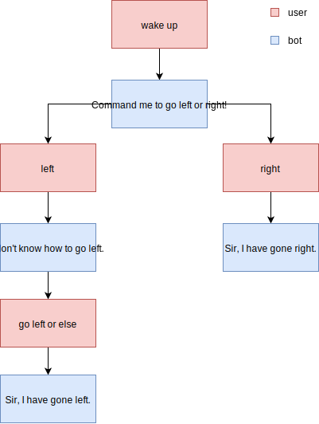

# State Machines

AbilityBot supports state machines using ReplyFlows. Internally, they set and transition the state of the user based on their actions so far. 
Developers may declare this flow control in either a bottom-up or a top-down approach. If you're already familiar with what a `Reply` is, consider ReplyFlows as the cherry on top.

## Usage
A ReplyFlow can not be directly instantiated; it must be built. First, let's create
some basic replies.
```java
Reply saidLeft = Reply.of(upd -> 
          silent.send("Sir, I have gone left.", getChatId(upd)),
          hasMessageWith("left"));

Reply saidRight = Reply.of(upd -> 
          silent.send("Sir, I have gone right.", getChatId(upd)),
          hasMessageWith("right"));
```
The first `Reply` effectively replies to any message that has the text "left". Once such a message is received, the
bot replies with "Sir, I have gone left". Likewise, the bot acts for when "right" is encountered.

What if now, you'd like to protect those two replies behind one more reply? Let's say, the bot first should ask the user to give it directions.
This means that people can't tell your bot to turn left or right UNLESS the bot asks for directions. Let's trigger that when the user sends "wake up" to the bot!

```java
// We instantiate a ReplyFlow builder with our internal db (DBContext instance) passed
// State is always preserved in the db of the bot and remains even after termination
ReplyFlow.builder(db)
          // Just like replies, a ReplyFlow can take an action, here we want to send a
          // statement to prompt the user for directions!
          .action(upd -> silent.send("Command me to go left or right!", getChatId(upd)))
          // We should only trigger this flow when the user says "wake up"
          .onlyIf(hasMessageWith("wake up"))
          // The next method takes in an object of type Reply.
          // Here we chain our replies together
          .next(saidLeft)
          // We chain one more reply, which is when the user commands your bot to go right
          .next(saidRight)
          // Finally, we build our ReplyFlow
          .build();
```
For the sake of completeness, here's the auxiliary method `hasMessageWith`.
```java
private Predicate<Update> hasMessageWith(String msg) {
      return upd -> upd.getMessage().getText().equalsIgnoreCase(msg);
}
```
To run this example in your own AbilityBot, just have a method return that ReplyFlow we just built. Yup, it's that easy, just like how you're used to 
building replies and abilities.
## More Complex States
Let's say that your bot becomes naughty when the user asks it to go left. We want the bot to say "I don't know how to go left." when the user commands it to go left. We would also like to chain more commands after this state. Here's
how that's done.
We must create a new ReplyFlow that would be chained to the initial one. Here's what our left flow would look like.
```java
ReplyFlow leftflow = ReplyFlow.builder(db)
          .action(upd -> silent.send("I don't know how to go left.", getChatId(upd)))
          .onlyIf(hasMessageWith("left"))
          .next(saidLeft)
          .build();
```
And now, saidLeft reply becomes:
```java
Reply saidLeft = Reply.of(upd -> silent.send("Sir, I have gone left.", getChatId(upd)),
          hasMessageWith("go left or else"));
```
Now, after your naughty bot retaliates, the user can say "go left or else" to force the bot to go left. Awesome, our logic now looks like this:
<div align="center">




</div>

## Complete Example
```java
public static class ReplyFlowBot extends AbilityBot {
  public class ReplyFlowBot extends AbilityBot {
    public ReplyFlowBot(String botToken, String botUsername) {
      super(botToken, botUsername);
    }

    @Override
    public int creatorId() {
      return <YOUR ID HERE>;
    }

    public ReplyFlow directionFlow() {
      Reply saidLeft = Reply.of(upd -> silent.send("Sir, I have gone left.", getChatId(upd)),
          hasMessageWith("go left or else"));

      ReplyFlow leftflow = ReplyFlow.builder(db)
          .action(upd -> silent.send("I don't know how to go left.", getChatId(upd)))
          .onlyIf(hasMessageWith("left"))
          .next(saidLeft).build();

      Reply saidRight = Reply.of(upd -> silent.send("Sir, I have gone right.", getChatId(upd)),
          hasMessageWith("right"));

      return ReplyFlow.builder(db)
          .action(upd -> silent.send("Command me to go left or right!", getChatId(upd)))
          .onlyIf(hasMessageWith("wake up"))
          .next(leftflow)
          .next(saidRight)
          .build();
    }

    @NotNull
    private Predicate<Update> hasMessageWith(String msg) {
      return upd -> upd.getMessage().getText().equalsIgnoreCase(msg);
    }
  }
```
## Inline Declaration
As you can see in the above example, we used a bottom-up approach. We declared the leaf replies before we got to the root reply flow.
If you'd rather have a top-down approach, then you may declare your replies inline to achieve that.
  
```java
ReplyFlow.builder(db)
          .action(upd -> silent.send("Command me to go left or right!", getChatId(upd)))
          .onlyIf(hasMessageWith("wake up"))
          .next(Reply.of(upd -> 
            silent.send("Sir, I have gone left.", getChatId(upd)),
            hasMessageWith("left")))
          .next(Reply.of(upd -> 
            silent.send("Sir, I have gone right.", getChatId(upd)),
            hasMessageWith("right")))
          .build();
```
## State Consistency
Under the hood, AbilityBot will generate integers that represent the state of the instigating user. However, 
if you add more replies and reply flows, these integers may no longer be consistent. If you'd like to always have consistent state IDs, you
should always pass a unique ID to the ReplyFlow builder like so:
```java
ReplyFlow.builder(db, <ID HERE>)
```